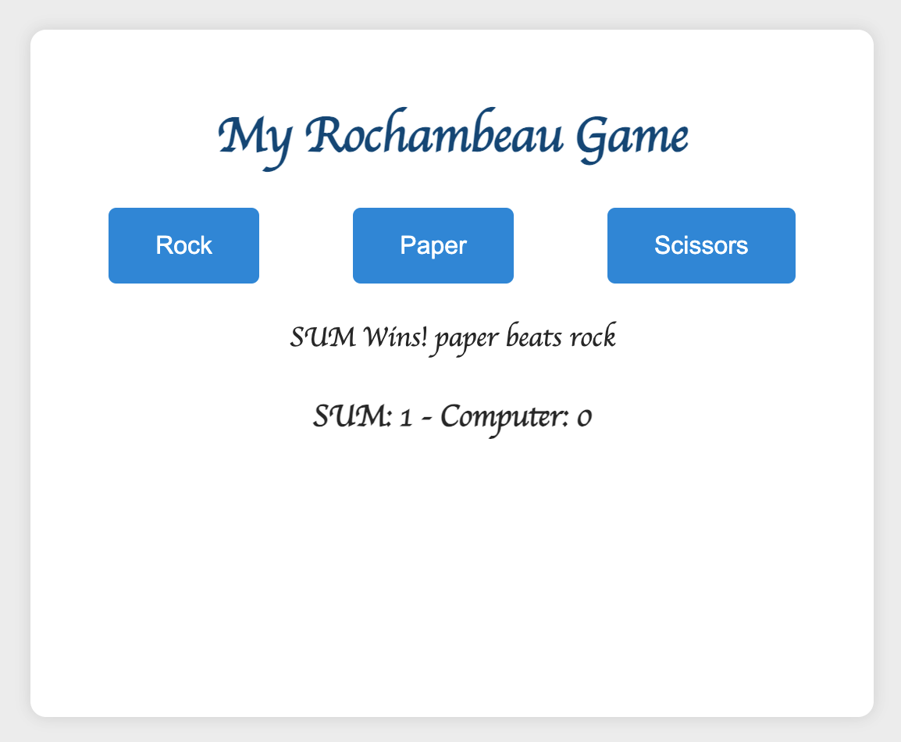

# Rock Paper Scissors (Rochambeau) Game

This is a simple Rock, Paper, Scissors game implemented using HTML, CSS, and JavaScript. The game allows the player to enter their name, play rounds against the computer, and announces the winner once either the player or the computer reaches 5 points.

## How to Play

- Open the `index.html` file in your web browser.
- Enter your name and click the "Start Game" button.
- Choose your move (Rock, Paper, or Scissors) by clicking the corresponding button.
- The game will display the result of each round and keep track of the score.
- The game announces the winner once a player reaches 5 points.

## Features

- Player name input.
- Dynamic updating of the game result and score.
- Announces the winner when either player or computer reaches 5 points.
- Play again functionality.

## Technologies Used

- HTML
- CSS
- JavaScript

Please refer to https://sumusa.github.io/rock-paper-scissors-game to play the game.
